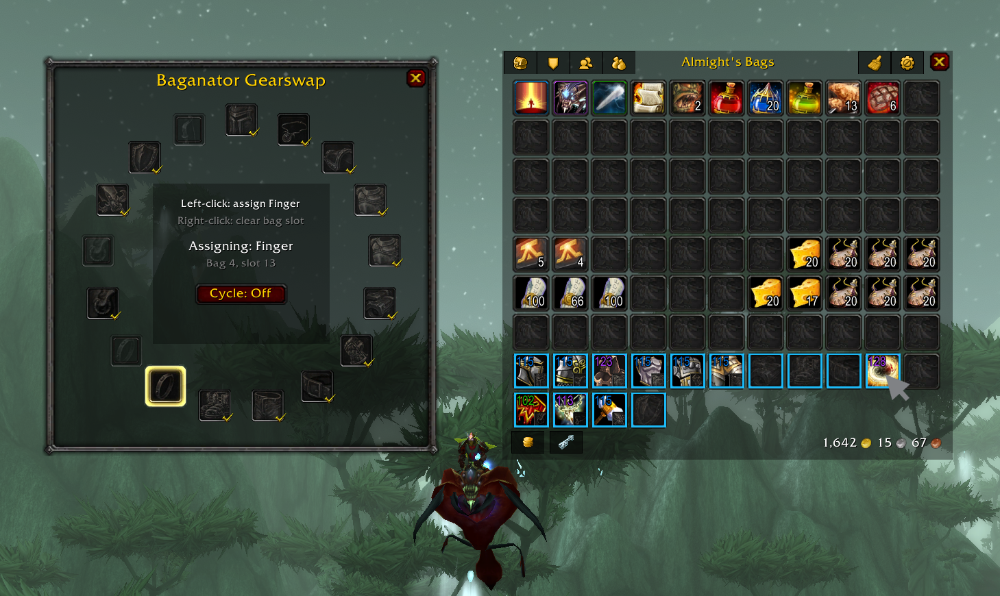

# Baganator Gearswap

Map Baganator bag slots to equipment slots and swap gear from those slots with a slash command. Built for **WoW TBC Classic Anniversary (2.5.5)**.

## What it does

Opens an assignment window where each equipment slot is shown in a ring. Pick an equipment slot, click a Baganator bag slot, and the addon remembers that bag location for future swaps.

When you run a swap, Baganator Gearswap equips the items from the assigned bag slots and puts the previously equipped items back into those same slots.

## Features

- **Baganator integration** - assign equipment slots directly from visible Baganator bag slots
- **Circular assignment UI** - equipment slots are grouped around a compact center panel
- **Mapped slot indicators** - assigned bag slots get equipment-slot badges and optional borders
- **Cycle assignment mode** - quickly step through unmapped equipment slots while assigning
- **Right-click clearing** - clear equipment or bag-slot mappings without extra dialogs
- **Compatibility checks** - skips items that do not match the assigned equipment slot
- **Safe swap flow** - stops on combat lockdown, locked items, cursor items, or blocked bag slots

## Commands

- `/bgswap assign` - open assignment mode
- `/bgswap swap` - swap gear from assigned bag slots
- `/bgswap clear` - clear all assigned slots

You can also use `/baganatorgearswap` instead of `/bgswap`.

## Install

1. Download or clone this repo
2. Copy the `Baganator_Gearswap/` folder into `World of Warcraft/_anniversary_/Interface/AddOns/`
3. Make sure **Baganator** is installed and enabled
4. Restart the client or `/reload`

## Dependency

Baganator Gearswap requires **Baganator**:

- [Baganator on GitHub](https://github.com/TheMouseNest/Baganator)
- [Baganator on CurseForge](https://www.curseforge.com/wow/addons/baganator)

## Author

**ViktorSveins**

## License

See [LICENSE](LICENSE).
